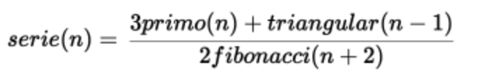

# Singular Test

En este  proyecto realizamos una pequeña vista en la cual podemos ingresar un numero n  y nos devuelve el termino n de la serie: 


## Herramientas utilizadas

Para este proyecto utilizamos las herramientas siguientes:

| Tecnología  | Version  |
|-------------|----------|
| React.JS    | 18.0.27  | 
| Typescript  | 4.9.3    |
| Vite        | 4.1.0    | 
| Vitest      | 0.30.1   |

Entre otras.

## Procedimiento para levantar el proyecto localmente

Para poder levantar el proyecto necesitamos seguir los siguientes pasos:

1. Clonamos el proyecto utilizando el comando
```sh
git clone git@github.com:shirley-startary/singular-test.git
```
2. Ingresamos a la carpeta del proyecto clonado.
```sh
cd singular-test
```
3. Realizamos la instalación de las dependencias para esto ejecutamos.
```sh
npm install 

```
4. Una vez instaladas las dependencias podemos levantar el proyecto con el código:
```sh
npm run dev
```
5. También podemos correr los test con el siguiente código
```sh
npm run test
```
el cual podremos visualizarlos en la terminal y también abrirá una vista en el navegador 

&copy; Proyecto realizado por Shirley Startary  